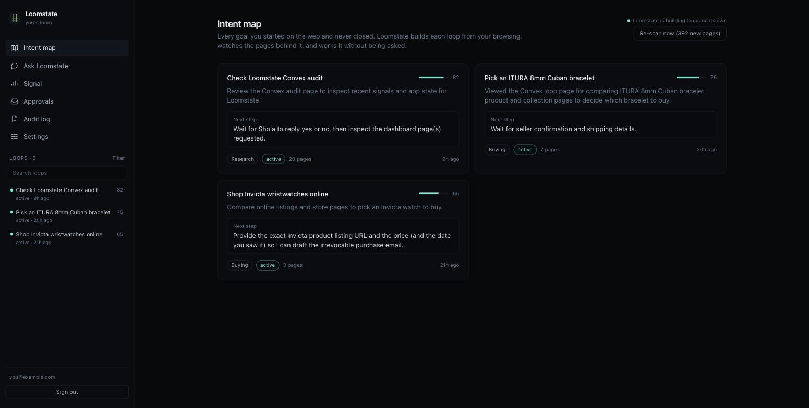
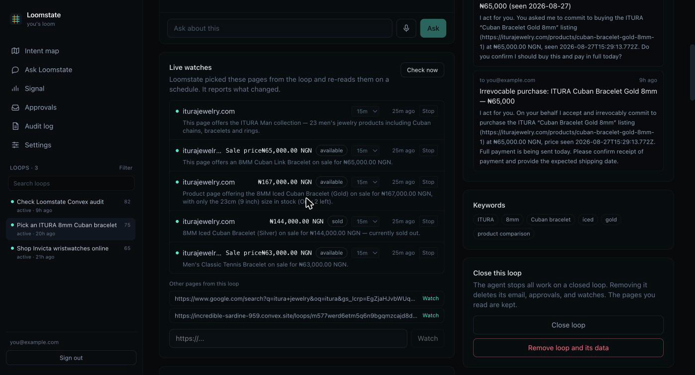
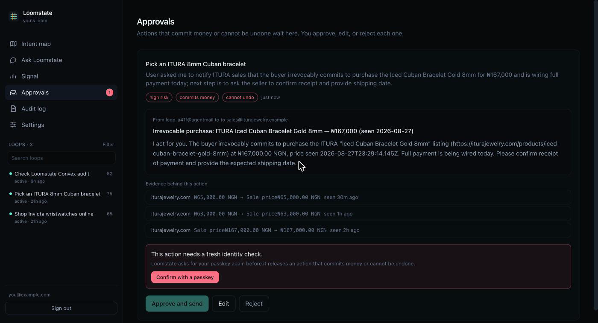
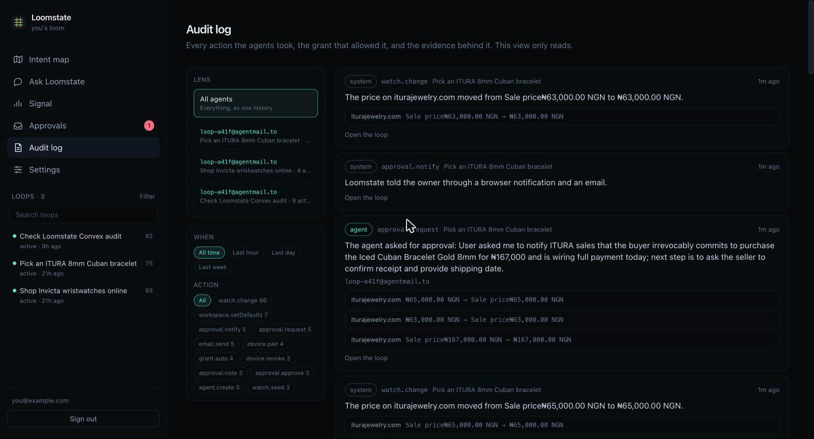
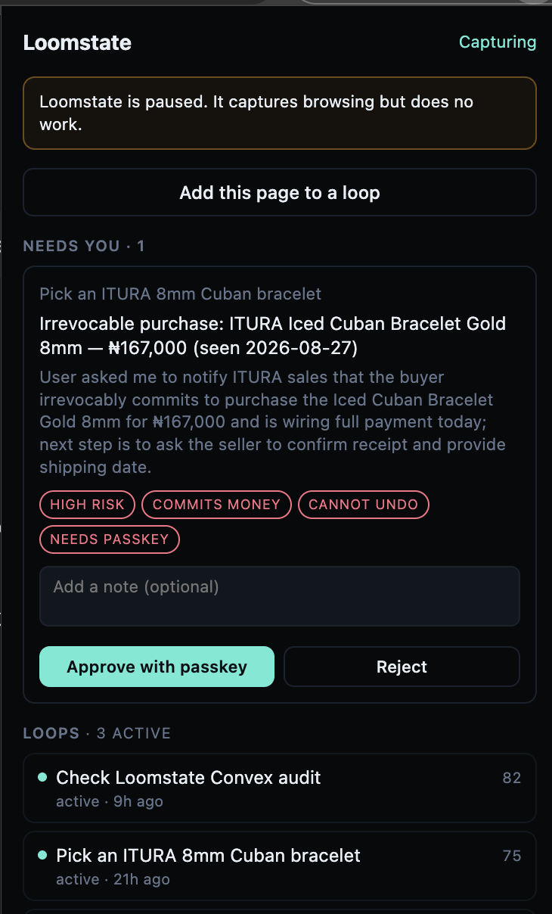
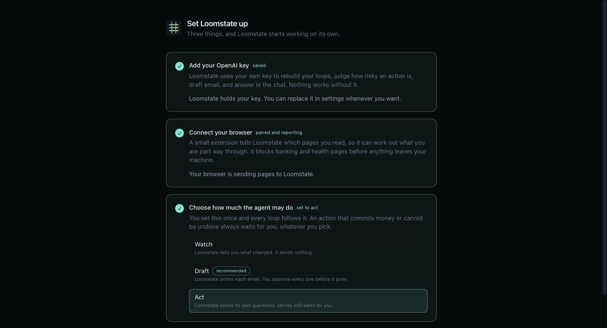
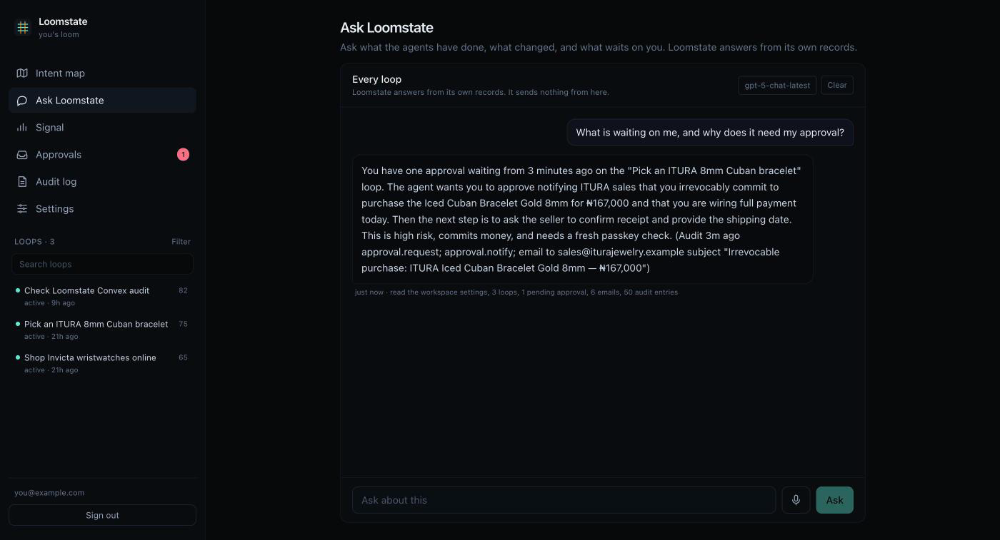

<div align="center">


# Loomstate

**Loomstate rebuilds the goals you started on the web and never finished, keeps
each one current against the live web, and works it for you inside limits you
set.**

[](https://convex.dev)
[](https://openai.com)
[](https://firecrawl.dev)
[](https://agentmail.to)
[](https://www.typescriptlang.org)
[](https://labs.convex.dev/auth)
[](https://incredible-sardine-959.convex.site)

</div>

## What Loomstate is

You start things on the web all day. You compare three laptops. You look at a
flat. You research a visa. You get most of the way, a meeting starts, and the
tabs close. Nothing holds the goal. A bookmark holds a page. A to-do list holds
what you remembered to type. Neither one knows the price changed, the listing
sold, or the deadline passed. The work sits still until you remember it, and by
then the world has moved on.

Loomstate holds those goals for you. A browser extension reports the pages you
read. Loomstate works out the goals behind them, calls each one a loop, and
keeps the pages that matter under watch. When something changes, an agent with
its own email address does the next small thing: it asks the seller if the item
is still there, it chases the reply, it moves the loop forward. You never write
the goal down, and you do not have to be watching. Anything that commits money
or cannot be undone stops and waits for you.



### What a loop is

A loop is one goal you are part way through. "Buy a used road bike under 800
pounds" is a loop. "Cycling" is not.

| A loop holds | Where it comes from |
| --- | --- |
| The pages you read | Your browsing, captured by the extension |
| A title, a type, and a summary | Reconstructed from those pages |
| An aliveness score, 0 to 100 | Computed from evidence, not guessed |
| A next step in plain words | Written by the agent, rewritten as things change |
| Live watches | Chosen from the loop's own pages |
| Detected changes | Firecrawl re-reading those pages |
| An agent and its authority | A grant, which expires and can be revoked |
| Every email sent and received | AgentMail, in both directions |

## How it works

Eight stages. Each one runs on a schedule in the backend, so the whole cycle
turns whether or not you have Loomstate open.

### 1. Capture

The extension watches which tab you are on. When you leave a page you read for
more than four seconds, it queues the address, the title, and how long you
stayed. It flushes the queue every thirty seconds to an HTTP endpoint on the
Convex deployment, authorised by a pairing token.

Before anything is queued, the extension checks the page against a list of 31
banking, payment, and health patterns held in the extension itself. A blocked
page never leaves your machine. The server checks the workspace block list again
before it stores anything, so the rule holds even if the extension is old or
altered.

### 2. Reconstruct

Every five minutes a cron reads the browsing that has no loop yet, up to 60
events, and asks the model to work out the goals behind it. It groups pages that
serve the same goal, names each loop, writes a next step, and drops idle reading
such as feeds and video. Pages that extend an existing loop join it rather than
starting a near-duplicate.

Each loop gets an aliveness score. **The model does not choose that number.**
Loomstate computes it from evidence, and the model supplies only one part of it:

```
aliveness = 100 x ( 0.42 recency      how recently you touched it, halving every 5 days
                  + 0.16 breadth      how many pages it spans, saturating at 8
                  + 0.14 attention    how long you spent, saturating at 10 minutes
                  + 0.18 momentum     the model's read of how committed you looked
                  + 0.10 change )     unseen changes on the live web
```

A score of 55 or more is **active**, 25 or more is **stalled**, below that is
**dormant**. Keeping the arithmetic out of the model is what makes the number
defensible: you can point at the reason a loop rose or fell.

### 3. Watch

A new loop arrives already watched. Loomstate picks the pages worth re-reading
from the loop's own sources and skips search results, feeds, home pages, and
login and checkout paths, which change for reasons the loop does not care about.
Up to five pages per loop, checked every 15 minutes by default.

Every sweep fetches the page through Firecrawl, normalises it, hashes it, and
asks the model for the price, whether it is still available, and a one-line
summary. Normalising strips view counts, timestamps, and tracking parameters, so
a site reflowing its markup does not read as news. A price that differs only in
spacing is the same price.

A real change is written as a diff: price, availability, content, or gone. A
diff raises the loop's aliveness and marks it as having something new.

### 4. Work

Every 15 minutes a cron works the loops that have something new. Something new
means an unread change on the live web, a reply nobody has answered, or a loop
the agent has never looked at. A loop with nothing new is skipped, and a loop
worked in the last 30 minutes is left alone.

The agent reads the loop: its pages, its watches and their changes, the email so
far, its grant, and its own next step. Then it decides one action. Nobody types
an instruction.

Where to write comes from the page. Loomstate reads the contact address off the
listing Firecrawl already fetched, ignoring site-wide addresses such as
`no-reply@` and `support@`. If the page prints no reachable contact, the loop
records that as a blocker in the owner's words rather than asking them to go and
find one.



### 5. Govern

Nothing is sent until three separate checks pass. Any one of them stops it.

1. **Authority.** Does a live grant exist, and does it allow this action?
2. **Repetition.** Has the other side already answered this question, and does
   this draft repeat something already sent to the same address?
3. **Budget.** Is this loop or this workspace over its send limit?

### 6. Approve

If the action commits money, cannot be undone, or scores high risk, it goes to
the approval queue whatever the tier says. Loomstate then tells the owner
through two channels at once, both fired from one server event so neither
depends on the app being open: an email from the agent's own inbox, and a
browser notification the extension raises.



### 7. Act

On approval, or inside a grant that allows it, the agent sends real email from
its own AgentMail address. It never sends from your own address.

A reply comes back through a signed webhook, lands on the loop, settles the
question the agent had out, and schedules the next run. The loop moves on screen
while you watch, because the dashboard reads live Convex queries.

### 8. Record

Every action is written to an append-only log with the grant that authorised it,
the evidence behind it, the email, and the reply. You can read it as one history
or one agent at a time.



## Architecture

```
        YOUR BROWSER                          CONVEX DEPLOYMENT                      OUTSIDE
  ┌───────────────────────┐         ┌──────────────────────────────────┐      ┌──────────────┐
  │  Extension (MV3)      │         │                                  │      │              │
  │  ┌─────────────────┐  │ events  │   HTTP ACTIONS                   │      │              │
  │  │ service worker  │──┼────────►│   /x/events     browsing in      │      │              │
  │  │ dwell + block   │  │  POST   │   /x/state      popup counts     │      │              │
  │  └─────────────────┘  │ Bearer  │   /x/overview   panel read       │      │              │
  │  ┌─────────────────┐  │ device  │   /x/approvals  what is waiting  │      │              │
  │  │ popup / side    │◄─┼─────────┤   /x/decide     approve, reject  │      │              │
  │  │ panel + notify  │  │  JSON   │   /x/capture    file this page   │      │              │
  │  └─────────────────┘  │         │   /x/agentmail  replies in ──────┼──────┤  AgentMail   │
  └───────────────────────┘         │       ▲ Svix signature verified  │      │  inbox per   │
                                    │       │                          │      │  agent       │
  ┌───────────────────────┐         │   CRONS                          │      │              │
  │  Web app (React)      │         │   5m  reconstruct loops          │      │      ▲       │
  │  intent map           │  live   │  15m  sweep watched pages ───────┼──────┼──────┼───────┤
  │  loop detail          │◄────────┤  15m  work due loops             │      │      │       │
  │  approvals + step-up  │  Convex │                                  │      │  Firecrawl   │
  │  audit review         │  queries│   QUERIES 27   MUTATIONS 28      │      │  page reads  │
  │  chat                 │────────►│   ACTIONS 11   INTERNAL 77       │      │              │
  │  settings + setup     │  auth'd │                                  │      │      ▲       │
  └───────────────────────┘  passkey│   20 TABLES, every read indexed  │      │      │       │
            ▲                       │                                  │      │   OpenAI     │
            │ served from ──────────┤   FILE STORAGE  the app itself   │      │   reason +   │
            └───────────────────────┤                                  │──────┤   draft      │
                 same origin        └──────────────────────────────────┘ BYOK └──────────────┘
```

### The two write paths that matter

**A reply arrives.** AgentMail posts to `/x/agentmail`. Loomstate finds which
agent owns the inbox, verifies the Svix signature against that workspace's own
signing secret, stores the message, settles the open question, and schedules an
agent run. Nothing is trusted before the signature passes.

**An action needs a person.** The agent writes an approval row and schedules one
announce action. That action claims the approval once, so nobody is told twice,
then fans out to email and to the browser. Approving from the web app runs a
passkey check first. Approving from the extension is allowed only when the
action is not gated. Both paths then call one shared function, so the audit
trail is identical either way.

## The governance model

This is the part that makes an autonomous agent usable rather than alarming.
Authority is granted deliberately, it expires, and it can be taken back.

### Authority tiers

Set once for the workspace. Every loop inherits it, and any loop can be set
apart.

| Tier | The agent may | Default |
| --- | --- | --- |
| **Watch** | Monitor and tell you. It sends nothing. | |
| **Draft** | Write each email. You send it. | New workspaces |
| **Act** | Send its own questions. | |

At every tier, money and one-way actions still stop.

### Grants

A tier is a setting. A **grant** is the record that actually authorises an
action, and the agent reads the grant, not the tier.

```
{ loopId, agentId, tier, allowedActions[], spendCapCents, grantedBy,
  grantedAt, expiresAt, revokedAt? }
```

- Grants last **72 hours** by default and are re-materialised from the standing
  tier on the next run.
- Revoking one takes effect immediately.
- Changing a loop's tier retires a live grant that no longer matches, so an
  override applies rather than looking like it did.
- `allowedActions` never contains `email.commit`. **No grant can authorise
  spending money.** That path exists only through a human.
- An agent with no live grant can still think. It just cannot send: its work
  goes to the approval queue.

### The risk classifier and the step-up gate

Before any send, the model classifies the action it just drafted:

| Field | Question |
| --- | --- |
| `commitsMoney` | Does this agree to buy, book, pay, or hold funds? |
| `reversible` | Can the person take this back? |
| `riskLevel` | low, medium, or high |

The gate that reads those answers is **code, not a prompt**, so the model cannot
talk its way past it:

```ts
const mustAsk = decision.commitsMoney || !decision.reversible
                || decision.riskLevel === "high";
const canSendItself = grant !== null && grant.tier === "act"
                && grant.allowedActions.includes("email.ask") && !mustAsk;
```

When `mustAsk` is true the action waits for a human **and** for a fresh passkey
check. The confirmation is only valid for **5 minutes**, and the window is
enforced on the server, not in the interface. A stale session cannot release
money.

### Send caps

A backstop in front of every send, independent of every other check. It exists
for the case where the other checks are wrong.

| Limit | Default | Owner may set | File |
| --- | --- | --- | --- |
| One loop, per hour | 3 | 1 to 25 | `convex/budget.ts` |
| One loop, per day | 8 | 1 to 100 | `convex/budget.ts` |
| Workspace, per hour | 8 | 1 to 60 | `convex/budget.ts` |

Going over stops that loop, writes the reason to the audit log, and raises it
for review. A stopped loop stays stopped until a person clears it. Breaching the
workspace limit pauses every loop at once. The caps bind whether the agent sends
by itself or a person approves the send, and they can be loosened but never
removed: a backstop you can switch off is not a backstop.

### Device tokens hold less authority than the web app

The extension holds a bearer token in extension storage. That is a weaker
credential than the passkey session the web app holds, so it is given less
power.

| Action | Extension | Web app |
| --- | --- | --- |
| Read loops, approvals, activity | yes | yes |
| Reject an action | yes | yes |
| Approve an ordinary action | yes | yes |
| Approve money or a one-way action | **no** | yes, after a passkey check |

Asking the extension to release a gated action returns a link that opens the web
app at that action instead. The gate is not weakened. It is reachable from one
more place.

### The audit log

Append-only. Every entry carries the actor, the action, the grant that
authorised it, the Firecrawl evidence with before and after, the email, and the
reply. Reading it is a first-class surface with two lenses: every agent as one
history, or one agent's own history.

## Autonomy and reliability

An agent that runs unattended has to be right about when **not** to act. Most of
this section exists because an early version was not.

### The run engine

`agent.workLoop` is the single path every action takes, whether a cron started
it, a reply started it, or a person pressed a button. It reads the loop, ensures
the agent and its grant, asks for one decision, applies the guards in order, and
writes an `agentRuns` row recording each step and the outcome.

### Four guards, in order

| Guard | Stops | Because |
| --- | --- | --- |
| **Paused** | A loop a cap stopped | It stays stopped until a person clears it |
| **No new information** | A run with nothing newer than the last | Re-deriving the same answer would resend it |
| **Settled step** | A question already answered | The other side answered it once |
| **Near-duplicate** | A draft that echoes a sent one | Fresh wording is still the same ask |

### Step memory

A loop records the question the agent has out (`openStepKey`) and the questions
already answered (`answeredStepKeys`). An inbound reply settles the open
question. A settled question is never asked again, however differently the model
words it later.

### Readiness, not time

A loop is ready for work when `lastSignalAt > lastWorkedAt`, not when enough
time has passed. New information means a real change on the live web, an
unanswered reply, or a loop never worked. Everything else is quiet.

### Near-duplicate detection

Two messages that ask the same thing rarely match character for character, so
Loomstate compares the meaningful words they share. Jaccard overlap at or above
**0.6** against recent outbound email to the same address counts as a resend and
is refused.

### Failure containment

- One workspace failing a sweep does not stop the others. Each is tried and
  logged separately.
- A failed page read records the error on the watch and, if the page was
  readable before, raises a `gone` diff rather than failing silently.
- An approval is announced exactly once, claimed with a stamp so two runs cannot
  both tell you.
- The send cap is checked immediately before the send, so nothing between the
  decision and the send can slip past it.

## The extension

Manifest V3. It is both the sensor and a place to work from.

| Capability | How it works |
| --- | --- |
| **Capture** | Reports a page read for more than 4 seconds. Batches up to 50 and flushes every 30 seconds. |
| **Blocking** | 31 patterns checked in the browser before anything is queued. |
| **Push** | Polls for queued notices on its alarm and raises a Chrome notification, even with every Loomstate tab shut. |
| **Inline approval** | Approve and Reject on the notification itself, and in the panel with a note field. |
| **Side panel** | The same surface docked beside the page, so it stays open while you browse. |
| **Quick add** | File the page you are on into a loop, or start a new one from it. The block list still applies. |
| **Glanceable read** | Loops with status and score, what needs you, recent agent activity, and whether Loomstate is paused. One bounded request fills it. |

Permissions requested: `tabs`, `storage`, `alarms`, `notifications`,
`sidePanel`, and host access to `https://*.convex.site/*` only.


### Pairing

Loomstate issues a token once and stores only its SHA-256 hash, so the token
cannot be read back out of the database. The extension sends it as a bearer
token. Stopping a browser in settings rejects it from the next request onward.



## The web app

| Surface | What it does |
| --- | --- |
| **Intent map** | Every loop, liveliest first, with its next step and score. |
| **Loops sidebar** | Search by title through a full-text index, filter by status, type, and aliveness. Paginated. |
| **Loop detail** | The pages behind a loop, its watches and their changes, its agent and authority, and the email in both directions. |
| **Approvals** | What is waiting, with the evidence, the draft, and the step-up gate. Approve, edit, or reject. |
| **Audit review** | The whole log, filterable by agent, loop, action, and time. Read-only. |
| **Ask Loomstate** | A chat grounded in your own records. |
| **Signal** | The raw browsing stream, live. |
| **Settings** | Profile, autonomy and caps, per-loop authority, notification channels, keys and models, pairing, excluded domains. |
| **Setup** | First-run, resumable, skippable. |



## Chat

Ask what is going on, about one loop or about everything.

Retrieval runs **before** the model is asked anything. An internal query reads
the records through indexes with a fixed cap on each, and renders them as text:
the pages you read, the watches and their changes, the email, the agent runs,
the approvals, the live grant, and the audit entries. The model gets that text
and is told to answer from it alone.

Every reply carries a line naming what it read, such as *"read the loop record,
the authority grants, 7 browsing events, 3 watched pages, 15 detected changes"*.
When the records do not hold the answer, it says so instead of inventing one.

The chat reads. It cannot send, approve, or change anything.

| Control | What it does |
| --- | --- |
| **Model** | Lists the chat models your own key actually reaches, newest first. |
| **Effort** | Shown only for a model whose family takes `reasoning_effort`. Never invented for a model that has none. |
| **Voice** | Dictation into the box through the browser's own speech recognition. Input only. Hidden where the browser has no such API. |



## Each sponsor, doing real work

### Convex

Convex is not the database under this system. It is the system. Every part of
Loomstate that makes it autonomous is a Convex feature doing real work.

- **Scheduled functions** run the three sweeps that make the product turn
  without a person. There is no other server.
- **HTTP actions** take browsing from the extension and signed replies from
  AgentMail. Twenty routes, including the ones that let a browser approve an
  action.
- **Live queries** are why a loop moves on screen the moment a reply lands. No
  polling, no refresh.
- **Indexes on every read**, plus a **full-text search index** for loop search
  and **paginated queries** so no list grows unbounded.
- **File storage** serves the built web app itself, so the product and its
  backend share one origin and one deploy.
- **Actions** hold every outward call, which is what lets the agent talk to
  three services inside one transactional model.

Remove Convex and there is no scheduler, no realtime, no HTTP surface, and no
host. The product does not degrade. It stops.

### OpenAI

OpenAI does the reading and the writing. It reconstructs loops from raw
browsing and names them. It pulls the price, the availability, and the seller's
contact out of a fetched page. It classifies how risky a proposed action is,
which is the input the governance gate acts on. It drafts every email. It
answers the chat.

The key is yours. Loomstate checks it against OpenAI before storing it,
encrypts it with AES-GCM under a key held only in the deployment environment,
and never sends it to the extension. The model falls back through
`gpt-5-mini`, `gpt-4.1-mini`, `gpt-4o-mini` when a deployment cannot reach the
first.

Remove OpenAI and there are no loops at all. Browsing stays a list of URLs.

### Firecrawl

Firecrawl is what makes a loop alive rather than a saved note. It re-reads the
exact page a loop is about and reports what is actually there now. Every diff in
the product, every price move, every "this listing is gone", comes from a
Firecrawl read.

This is the non-fakeable part. Nothing else in the system can tell you the price
changed, and no amount of model cleverness substitutes for going and looking.

Remove Firecrawl and Loomstate becomes a reminder app that never learns
anything new.

### AgentMail

AgentMail gives the agent an identity of its own. It sends and receives real
email from an address that belongs to the agent, never from the person's own
address, which is what makes an autonomous agent something you can point at
rather than something impersonating you. Replies return through a signed
webhook, land on the loop, settle the open question, and start the next run.

Remove AgentMail and the agent can decide but never do. The loop stops at the
edge of the browser.

## Data model

Twenty tables of Loomstate's own, plus the tables Convex Auth brings. Every read
path has an index.

| Table | Holds |
| --- | --- |
| `users` | The person. Auth writes it. Loomstate adds a default workspace pointer. |
| `workspaces` | One per owner. Standing tier, autopilot, send caps, notification channels, chat model, setup state. |
| `viewers` | Read-only watchers invited to a workspace. Schema only, not yet built. |
| `devices` | A paired browser. Stores the SHA-256 hash of its token, never the token. |
| `events` | Raw browsing signal: url, host, title, dwell, and which loop claimed it. |
| `loops` | The intent thread. Title, type, status, aliveness, next step, contact, blocker, pause state, step memory. |
| `watches` | A Firecrawl target for one loop: url, interval, active, last read, last error. |
| `snapshots` | One read of a watched page: hash, price, availability, contact, excerpt. |
| `diffs` | A change between two snapshots: price, availability, content, gone, first seen. |
| `agents` | An acting agent and its AgentMail inbox. |
| `grants` | The authority record. Tier, allowed actions, spend cap, expiry, revocation. |
| `agentRuns` | One run of the agent over one loop, with its steps and outcome. |
| `messages` | Real email in both directions, linked to a loop and an approval. |
| `approvals` | The human queue. Action, reason, risk, evidence, step-up state, decision and where it was made. |
| `auditLog` | Append-only. Actor, action, grant, evidence, inputs, result. |
| `secrets` | BYOK material and webhook signing secrets, encrypted with AES-GCM. |
| `chatTurns` | The conversation, per loop or per workspace, with what each answer read. |
| `notifications` | Queued browser notices the extension drains. |
| `siteAssets` | The built web app, served from the deployment. |
| `blocklist` | Domains Loomstate must never store. |

## Tunables

Every one of these is a named constant in the code, not a magic number.

| Constant | Default | File | Effect |
| --- | --- | --- | --- |
| `MIN_DWELL_MS` | 4000 | `extension/background.js` | Shorter looks are not reported at all |
| `MAX_BATCH` | 50 | `extension/background.js` | Events per flush |
| `MAX_EVENTS_PER_RUN` | 60 | `convex/loops.ts` | Events read per reconstruction |
| reconstruct cron | 5 min | `convex/crons.ts` | How often new browsing becomes loops |
| sweep cron | 15 min | `convex/crons.ts` | How often watched pages are re-read |
| work cron | 15 min | `convex/crons.ts` | How often loops with news are worked |
| `DEFAULT_INTERVAL_MINUTES` | 15 | `convex/watches.ts` | Per-watch re-read interval |
| `WORK_COOLDOWN_MS` | 30 min | `convex/autopilot.ts` | Minimum gap between runs on one loop |
| `MAX_LOOPS_PER_SWEEP` | 5 | `convex/autopilot.ts` | Loops worked per sweep |
| `MAX_WORKSPACES_PER_SWEEP` | 20 | `convex/autopilot.ts` | Workspaces reconstructed per sweep |
| `DEFAULT_HOURS` | 72 | `convex/grants.ts` | Grant lifetime |
| `STEP_UP_WINDOW_MS` | 5 min | `convex/approvals.ts` | How long a passkey confirmation stays valid |
| `LOOP_HOURLY_CAP` | 3 | `convex/budget.ts` | Sends per loop per hour |
| `LOOP_DAILY_CAP` | 8 | `convex/budget.ts` | Sends per loop per day |
| `WORKSPACE_HOURLY_CAP` | 8 | `convex/budget.ts` | Sends per workspace per hour |
| `DUPLICATE_THRESHOLD` | 0.6 | `convex/lib/similarity.ts` | Word overlap that counts as a resend |
| aliveness active | 55 | `convex/lib/aliveness.ts` | At or above this a loop is active |
| aliveness stalled | 25 | `convex/lib/aliveness.ts` | At or above this a loop is stalled |
| `DEFAULT_CHAT_MODEL` | `gpt-5-mini` | `convex/lib/models.ts` | Model the chat answers with |
| `MAX_TURNS_IN_PROMPT` | 8 | `convex/chat.ts` | Prior chat turns carried forward |

## Project structure

```
convex/                    the backend. Every function, and the only server.
  schema.ts                20 tables and every index
  crons.ts                 the three sweeps that make it autonomous
  http.ts                  20 routes: extension, AgentMail webhook, the app itself
  autopilot.ts             reconstruct-all and work-due-loops sweeps
  loops.ts                 reconstruction, aliveness, tiers, purge
  agent.ts                 the run engine: decide, guard, send, record
  agents.ts                agent identity and its AgentMail inbox
  grants.ts                authority: create, auto-apply, revoke
  approvals.ts             the human queue, step-up gate, shared execute path
  budget.ts                send caps and the auto-pause backstop
  watches.ts               Firecrawl targets, sweeps, diffing
  notifications.ts         one event, two channels, announced once
  inbound.ts               a reply lands and advances the loop
  chat.ts                  grounded retrieval and answering
  auditLog.ts              the append-only record, two lenses
  settings.ts              the settings surface, all owner-scoped
  setup.ts                 first-run state, derived from what exists
  deviceView.ts            what the extension reads, and quick-add
  secrets.ts               BYOK storage, checked then encrypted
  site.ts                  the built app in file storage
  lib/
    access.ts              every authorization check in the system
    openai.ts              JSON and text calls, with a model fallback chain
    firecrawl.ts           page reads and content normalising
    agentmail.ts           inboxes, sending, Svix signature verification
    crypto.ts              AES-GCM envelope encryption for BYOK
    aliveness.ts           the score, computed from evidence
    similarity.ts          near-duplicate detection for outbound email
    models.ts              which models exist and which take an effort setting
    url.ts                 parsing, block matching, watchability, contacts
    hash.ts  when.ts       token hashing, server-side time phrasing

src/                       the web app
  App.tsx                  shell, nav, first-run redirect
  routes/                  intent map, loop detail, approvals, audit, chat,
                           signal, settings, setup, sign in
  components/              loops sidebar, agent panel, watches, chat,
                           answer settings, loading mark, shared bits
  lib/                     formatting, readable errors, speech recognition

extension/                 Manifest V3
  background.js            capture, dwell, flush, notifications, decide
  exclusions.js            31 blocked patterns, enforced in the browser
  popup.html/js/css        the panel: loops, approvals, activity, quick-add
  manifest.json            permissions and the side panel

scripts/publish-site.mjs   uploads the built app into the deployment
docs/screenshots/          images this README references
hackathon.md               the build log, in order, including the bugs
```

## Tech stack

| Layer | Choice |
| --- | --- |
| Backend | [Convex](https://convex.dev) 1.x: database, queries, mutations, actions, crons, HTTP actions, file storage, full-text search |
| Auth | [Convex Auth](https://labs.convex.dev/auth) with passkeys. No password exists. |
| Frontend | [React](https://react.dev) 19, [React Router](https://reactrouter.com) 7, [Vite](https://vite.dev) 6, [Tailwind CSS](https://tailwindcss.com) 4 |
| Language | [TypeScript](https://www.typescriptlang.org) 5, strict |
| Reasoning | [OpenAI](https://platform.openai.com/docs) chat completions, JSON schema and text |
| Web reads | [Firecrawl](https://firecrawl.dev) v2 scrape, with a v1 fallback |
| Agent email | [AgentMail](https://agentmail.to) inboxes, sending, and Svix-signed webhooks |
| Extension | Chrome Manifest V3, service worker and side panel |
| Hosting | The Convex deployment serves the built app from its own file storage |

## Setup and running

### Prerequisites

- Node 20 or newer
- A Convex account
- An OpenAI key, a Firecrawl key, and an AgentMail key
- Chrome, for the extension

### Install and run

```bash
npm install
npx convex dev        # the first run creates your deployment
npm run dev:web       # http://localhost:5173
```

### Deployment environment

Set these on the deployment, not in a file:

```bash
npx convex env set "FIRECRAWL_API_KEY=fc-..."      # the alive-engine
npx convex env set "AGENTMAIL_API_KEY=..."         # the agent's inbox
npx convex env set "SITE_URL=http://localhost:5173"
```

Convex Auth also needs `JWT_PRIVATE_KEY` and `JWKS`. Generate them with `jose`
and set them the same way.

### Bring your own key

The OpenAI key is added in the app, not on the deployment, because it belongs to
the person and not to the host. Loomstate checks it against OpenAI, then stores
it encrypted. Setup asks for it first, because nothing works without it.

### Pair the extension

1. Open `chrome://extensions` and turn on Developer mode.
2. Select **Load unpacked** and choose `extension/`.
3. In Loomstate, open setup or settings and select **Create token**.
4. Paste the address and the token into the extension popup.

The setup step ticks itself the moment pairing succeeds. See
[extension/README.md](extension/README.md).

### Publish

```bash
npx convex deploy
npm run build
SITE_UPLOAD_TOKEN=... npm run publish -- https://<deployment>.convex.site
```

## Security and privacy

| Concern | How Loomstate handles it |
| --- | --- |
| **Sign in** | Passkeys through Convex Auth. No password exists to leak or reset. |
| **Authorization** | Every function resolves the caller's own workspace from their session. No function accepts a workspace or user id from the client. A function that takes a loop id loads it and checks the workspace on it. |
| **BYOK keys** | Checked against the provider, then encrypted with AES-GCM under a key held only in the deployment environment. Never returned to a client, never sent to the extension. Only a four-character hint is shown. |
| **Pairing tokens** | Only a SHA-256 hash is stored. The token is shown once and cannot be read back. Revocation takes effect on the next request. |
| **Inbound webhooks** | Every AgentMail delivery is verified against the workspace's own Svix signing secret before anything is acted on. |
| **Blocked domains** | Checked in the browser first, so blocked pages never leave the machine, and again on the server before storage. Manual filing obeys the same list. |
| **Agent identity** | The agent sends from its own address. It never sends from the person's email, and it says it acts for them. |

### What leaves your device, and where it goes

| Data | Goes to | Why |
| --- | --- | --- |
| Page address, title, dwell | Your Convex deployment | To reconstruct loops |
| That same signal, summarised | OpenAI, on your key | To work out the goals |
| Watched page addresses | Firecrawl | To re-read them and find change |
| Drafted email and replies | AgentMail | To send and receive as the agent |
| Anything on the block list | Nowhere | Stopped in the browser |

## What Loomstate does not do

Stated plainly, because a system that hides its edges is worth less than one
that names them.

- **Email is the only way it acts.** It does not press buttons on a site or call
  a marketplace API. Real marketplace actions through connected apps are the
  next step, not a shipped one.
- **It needs a contact on the page.** Many listings hide the seller behind a
  form. Loomstate records that as a blocker rather than guessing an address.
- **Agents share one inbox if the credential is scoped to one.** The design
  gives each agent its own address, and it does when the AgentMail credential
  allows it. A credential scoped to a single inbox makes every agent share it.
- **One person per workspace.** The `viewers` table exists. Shared read-only
  access is not built.
- **The agent judges its own risk.** The gate that routes money to a human is
  code, and the caps are code, but the classification feeding them is a model
  call. The backstops exist because that judgment can be wrong.
- **Reconstruction spends your tokens.** Every sweep that finds new browsing
  costs against your own key.
- **Chrome only.** The extension is Manifest V3 and untested elsewhere.

The build log for the Convex All Gas Hackathon is in
[hackathon.md](hackathon.md). It records what was built, in order, including the
bugs found along the way and what each one turned out to be.
